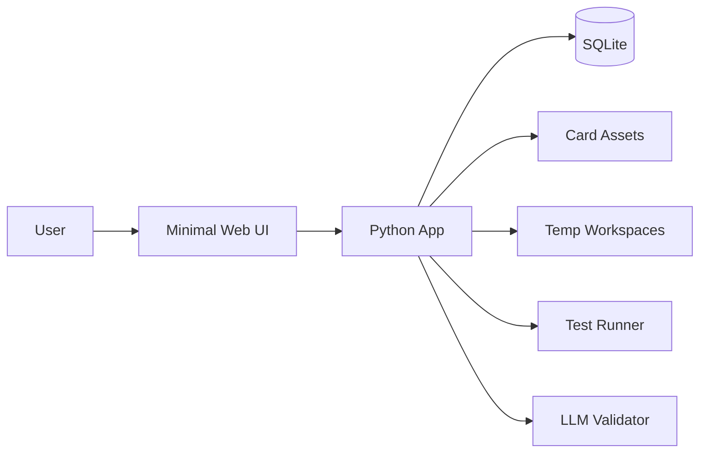
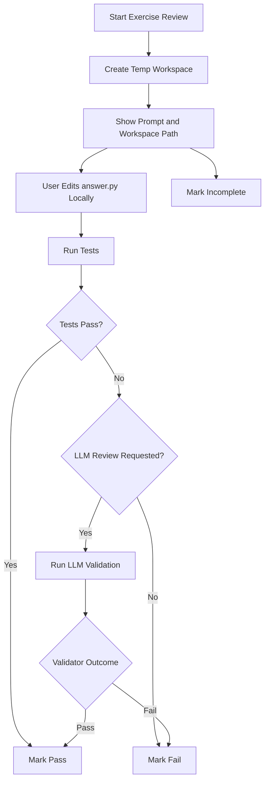
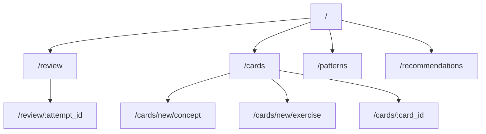

# BarskyProtocol Design

## Goal

Build a local-first CLI study system for retaining anything worth revisiting:

- technical concepts
- code patterns
- vocabulary
- quiz misses
- debugging heuristics
- definitions and tradeoffs
- implementation exercises

The system should be simple enough to use daily, predictable enough to trust, and
structured enough to extend later.

## Product Direction

The initial version should optimize for:

- low friction capture
- a clear daily review queue
- deterministic scheduling
- local storage
- reproducible code exercise review
- actionable feedback on failure patterns
- a minimal, readable web UI
- minimal operational overhead

The initial version should not optimize for:

- mobile sync
- AI-generated cards
- a complex adaptive scheduler
- rich note-taking
- notebook-specific storage formats
- decorative UI effects

## System Overview

The product is a local-first Python application with a minimal web UI running on
`localhost`. The CLI remains useful for setup, migrations, imports, and other
admin tasks, but the primary study workflow lives in the browser.



## Core Study Model

The system uses typed cards with a shared spaced-repetition foundation.

In the earliest version, the scheduler can fall back to a simple 5-box Leitner
schedule. That fallback is meant to bootstrap the product, not define the final
optimization strategy.

### Relationship to Spaced Repetition

At its core, this project is still a spaced repetition system.

It keeps the defining mechanics of spaced repetition:

- items are scheduled for review over increasing intervals
- review outcomes determine when an item should be seen again
- the goal is long-term retention through repeated active recall

What makes this project different from a basic flashcard SRS is not the
underlying learning mechanism, but the product layer built around it.

This system extends a standard SRS in three ways:

- it supports both `concept` cards and `code_exercise` cards
- it treats code reimplementation as a first-class review task
- it analyzes failure patterns and generates study recommendations

The distinction is:

- spaced repetition is the learning mechanism
- a scheduler is the strategy that decides the next interval
- Leitner is the initial fallback scheduler
- BarskyProtocol is the product built on top of those ideas for technical study

In other words, this is not an alternative to spaced repetition. It is a
specialized spaced repetition system designed for technical learning, especially
code practice and failure-driven improvement.

Supported v1 card types:

- `concept`
- `code_exercise`

Rules:

- New cards start in box 1
- New cards are due immediately
- Every review produces a stored outcome
- The scheduler computes the next review date from that outcome and prior history

Bootstrap fallback behavior:

- `pass`: move up one box, capped at box 5
- `fail`: reset to box 1
- `incomplete`: keep the current box and reschedule soon

Bootstrap fallback intervals:

| Box | Interval |
| --- | --- |
| 1 | 1 day |
| 2 | 2 days |
| 3 | 4 days |
| 4 | 8 days |
| 5 | 16 days |

This fallback keeps the system usable from day one while the adaptive scheduler
is phased in.

## Card Types

### `concept`

This is the classic flashcard form.

Structure:

- prompt
- answer
- optional topic
- optional tags
- optional source

Use it for:

- definitions
- tradeoffs
- API recall
- debugging heuristics
- short conceptual explanations

### `code_exercise`

This is a reimplementation task rather than a simple text recall task.

Structure:

- metadata in the database
- exercise assets on disk

Use it for:

- reimplementing a function, module, or class
- practicing algorithmic patterns
- reproducing a technique from memory
- rebuilding a small utility without copying the original

The review task is:

1. read the prompt
2. implement the required Python code
3. run validation
4. record the result

This avoids the false simplicity of forcing code-learning into a plain
question-answer format.

## App Surface

Proposed v1 surface:

### Web Routes

#### `/`

Dashboard with:

- due count
- overdue count
- recent pass/fail/incomplete totals
- weak topics
- a clear `Start Review` action

#### `/review`

Start a review session, optionally filtered by mode:

- mixed
- concept only
- exercise only

#### `/review/{attempt_id}`

Single-card review screen for either card type.

#### `/cards`

List, filter, and inspect cards.

#### `/cards/new/concept`

Create a concept card.

#### `/cards/new/exercise`

Create a code exercise card and scaffold its assets.

#### `/cards/{card_id}`

Card detail page with metadata, history, and recent failures.

#### `/patterns`

Show failure clusters and weak areas.

#### `/recommendations`

Show concrete study recommendations tied to observed evidence.

### CLI Commands

The CLI remains intentionally small and administrative.

#### `init`

Bootstrap local storage and schema.

Responsibilities:

- create storage directories
- initialize SQLite schema
- validate config

#### `serve`

Run the local web application.

#### `add-concept`

Create a concept card.

Inputs:

- prompt
- answer
- optional topic
- optional tags
- optional source

Behavior:

- store the card
- mark it due immediately

#### `add-exercise`

Create a code exercise card and scaffold its files.

Inputs:

- id or slug
- title
- topic
- tags
- prompt

Generated assets:

- metadata file
- prompt file
- starter module
- reference solution
- tests
- optional rubric

#### `migrate`

Apply local schema migrations if needed.

#### `export`

Export cards or review history for backup or analysis.

## Web UI Principles

The web UI should be simple, sparse, and fast to scan.

Design rules:

- server-rendered pages first
- one clear action per screen
- minimal color, with sane fallback
- stable labels and spacing
- no dashboard clutter
- no decorative motion or pseudo-productivity chrome
- no embedded IDE in v1

The UI should feel like a focused local tool rather than a SaaS product shell.

Preferred output style:

- narrow content width
- short headers
- compact metadata lines
- obvious primary actions
- explicit `pass`, `fail`, and `incomplete` states
- readable filesystem paths for exercise workspaces

For review pages, the UI should show only the information needed for the current
step. It should not dump the full card record by default.

## Review Modes

## End-to-End Logic

This section explains the full logic of the tool from study material creation to
review, validation, rescheduling, and recommendation generation.

### 1. Create Study Material

The user creates one of two card types:

- `concept`
- `code_exercise`

For a concept card:

1. The user writes a prompt and answer.
2. The app stores the card in SQLite.
3. The card starts in box 1.
4. The card is due immediately.

For a code exercise card:

1. The user creates an exercise with a title, prompt, topic, and tags.
2. The app scaffolds the canonical exercise assets on disk.
3. The exercise includes at least:
   - `prompt.md`
   - `answer.py`
   - `solution.py`
   - `tests.py`
4. The app stores the exercise metadata in SQLite.
5. The exercise starts in box 1.
6. The exercise is due immediately.

The canonical exercise directory is the source of truth. It is not modified
during review attempts.

### 2. Build the Daily Queue

When the user opens the app:

1. The app reads all cards where `next_review_at <= now`.
2. The app groups them into a due queue.
3. The user can review:
   - mixed cards
   - concept only
   - exercise only

The scheduler decides what is due. The UI decides how it is presented.

### 3. Run a Concept Review

For a concept card:

1. The review page shows the prompt.
2. The user recalls the answer mentally.
3. The user reveals the answer.
4. The user marks the outcome as:
   - `pass`
   - `fail`
   - `incomplete`
5. The app records the review result.
6. The app updates the box and next review date.
7. The app moves to the next card.

### 4. Run a Code Exercise Review

For a code exercise card:

1. The app creates a fresh temp workspace for the attempt.
2. The workspace is copied from the canonical exercise assets.
3. The review page shows:
   - the exercise prompt
   - the workspace path
   - the target file to edit, `answer.py`
4. The user opens the workspace in their own editor.
5. The user reimplements the solution in `answer.py`.
6. The user returns to the app and runs validation.

The web app coordinates the attempt. The actual coding happens in the user's
local editor.

### 5. Validate the Attempt

Validation always starts with deterministic tests.

1. The app runs the exercise's `tests.py` against the temp workspace.
2. If tests pass:
   - the attempt is eligible for `pass`
   - the app may optionally allow an LLM review
3. If tests fail:
   - the app records failing tests
   - the attempt is marked `fail` unless the user requests further review
4. If the user stops before validation completes:
   - the attempt is marked `incomplete`

Optional LLM validation is secondary:

1. The user explicitly requests LLM review, usually after a failed test run.
2. The app sends the prompt, expected behavior, user implementation, and test
   outcome to the LLM.
3. The LLM returns a structured summary of likely correctness issues.
4. The app stores that summary as supportive evidence, not as the only source of
   truth.

Tests are required for every exercise. The LLM is additive, not foundational.

### 6. Record the Review Outcome

After review or validation:

1. The app creates a review record.
2. The record stores:
   - card id
   - result
   - prior box
   - new box
   - next review date
   - review duration
   - workspace path, if relevant
   - failing tests, if relevant
   - validator summary, if relevant
3. The app updates the card's scheduling fields.

This review record is the basis for both scheduling history and analytics.

### 7. Reschedule the Card

The scheduler computes the next review time based on the result, the card type,
and the available history.

In the fallback Leitner mode:

For `pass`:

1. Move the card up one box, capped at box 5.
2. Set `next_review_at` using that box's interval.

For `fail`:

1. Reset the card to box 1.
2. Set `next_review_at` using the box 1 interval.

For `incomplete`:

1. Keep the card in its current box.
2. Reschedule it soon.
3. Record that the review was unfinished rather than incorrect.

In the adaptive modes:

- the next interval is computed from the card type and review history
- concept and exercise cards may receive different interval adjustments
- analytics-derived signals can influence the next review timing

This preserves the distinction between poor recall and interrupted work while
leaving room for better interval selection over time.

### 8. Manage the Temp Workspace

Temp workspace retention depends on the outcome.

For `pass`:

- delete the temp workspace by default

For `fail`:

- retain the latest workspace so the user can inspect or continue

For `incomplete`:

- retain the latest workspace so the user can resume later

By default, the system should keep only the latest retained workspace per card.

### 9. Learn from Failure Patterns

The app periodically analyzes accumulated review history.

1. It aggregates review records by card, topic, tag, and card type.
2. It identifies patterns such as:
   - repeated resets
   - repeated incompletes
   - failing tests that recur across attempts
   - topics with unusually high failure rates
3. It converts those findings into concrete recommendations.

Examples:

- split an oversized exercise
- add concept cards around a recurring failure theme
- reduce new-card intake in an overloaded topic
- add a smaller edge-case drill

### 10. Close the Loop

The tool is designed as a loop rather than a one-off review interface.

1. Study something new.
2. Capture it as a concept card or code exercise.
3. Review what is due.
4. Validate the attempt.
5. Reschedule based on the result.
6. Analyze failure patterns.
7. Adjust future study material based on those patterns.

That loop is the real product logic:

- capture
- review
- check
- reschedule
- analyze
- improve

### Concept Review

Flow:

1. Show prompt
2. Let the user recall the answer
3. Reveal answer
4. Mark `pass`, `fail`, or `incomplete`
5. Update scheduling

### Code Exercise Review

Flow:

1. Create a fresh temp workspace
2. Show prompt and workspace path
3. User edits `answer.py` locally
4. User runs validation from the web UI
5. App records `pass`, `fail`, or `incomplete`
6. App updates scheduling and analytics



Temp workspace policy:

- delete on `pass`
- retain latest workspace on `fail`
- retain latest workspace on `incomplete`

### `patterns`

Show failure clusters and weak areas based on review history.

Examples:

- most-reset topics
- cards with repeated lapses
- exercises failing on similar test cases
- concept cards with chronic resets

### `recommend`

Generate concrete study recommendations from the accumulated review history.

Examples:

- split an exercise that is too broad
- create concept cards for recurring failure themes
- reduce new-card intake for an overloaded topic
- add edge-case drills for specific implementation gaps

## Data Model

### `cards`

Primary study item table.

Fields:

- `id`
- `type`
- `title`
- `topic`
- `tags`
- `source`
- `asset_path`
- `box`
- `lapse_count`
- `created_at`
- `updated_at`
- `last_reviewed_at`
- `next_review_at`
- `last_result`

Rationale:

- `type` allows different review flows under one scheduler
- `title` is a stable summary across card types
- `asset_path` points to exercise assets for non-text cards
- `box` is the active Leitner position
- `lapse_count` tracks instability over time
- `next_review_at` drives the daily queue
- `topic` and `tags` enable filtering without overcomplicating structure

### `concept_cards`

Concept-specific content.

Fields:

- `card_id`
- `prompt`
- `answer`

Rationale:

- keeps the base `cards` table generic
- avoids null-heavy rows once multiple card types exist

### `exercise_cards`

Exercise-specific metadata.

Fields:

- `card_id`
- `instruction_path`
- `starter_path`
- `solution_path`
- `test_path`
- `validator_type`
- `entrypoint`

Rationale:

- the scheduler should not have to know exercise file layout
- exercise review needs deterministic paths
- validator choice should be explicit

### `reviews`

Append-only review history.

Fields:

- `id`
- `card_id`
- `reviewed_at`
- `result`
- `prior_box`
- `new_box`
- `next_review_at`
- `review_duration_seconds`
- `failure_reason`
- `validator_summary`
- `failing_tests`
- `recommendation_snapshot`
- `workspace_path`

Rationale:

- preserves history for future analytics
- allows debugging schedule behavior
- supports retention reports and failure analysis
- stores enough context for recommendation generation

## Failure Analytics

The tool should analyze failure patterns continuously and convert them into
specific study advice.

Core principle:

- scheduling decides when to review
- analytics explains why retention is failing

Signals to track:

- repeated resets on the same card
- repeated failures within a topic
- repeated failures within a tag cluster
- time spent per review
- failing test names for exercises
- validator summaries for code exercises
- cards that plateau in low boxes

Primary pattern classes:

- unstable concept recall
- unstable implementation recall
- edge-case blindness
- oversized exercise scope
- topic overload
- repeated confusion between related ideas

Examples of recommendations:

- "Split this exercise into two smaller drills."
- "Create three concept cards covering cancellation semantics."
- "Add an edge-case card for empty input and boundary indices."
- "Reduce new cards in `algorithms` until backlog stabilizes."

Implementation rule:

- deterministic heuristics should generate the underlying findings
- LLMs should summarize or phrase recommendations, not invent the evidence

This avoids vague or ungrounded advice.


## Storage Choice

Use SQLite for scheduling metadata and filesystem assets for exercise content.

Why SQLite:

- local-first
- zero service setup
- reliable enough for long-term use
- supports filtering, history, and statistics cleanly
- easier to evolve than flat JSON once review logs exist

Why filesystem assets:

- Python exercises are better represented as files than long text blobs
- tests, starter code, and reference implementations should be diffable
- modules can be executed directly by local tooling

Why not JSON first:

- review history becomes awkward quickly
- concurrent writes and schema changes are messy
- filtering and stats become more manual than necessary

Why not store `.ipynb`:

- the actual study artifact is Python code
- notebooks are noisy in git
- validation is easier against `.py`
- notebook-style exercises can still be expressed as Python scripts

## Configuration

Use a repo-local `config.toml` for the project version.

Initial config fields:

```toml
[study]
data_dir = ".barsky"
database = ".barsky/study.db"
scheduler = "leitner_fallback"
concept_scheduler = "leitner_fallback"
exercise_scheduler = "leitner_fallback"
box_intervals = [1, 2, 4, 8, 16]
review_order = "oldest-first"
cards_dir = "cards"
llm_validator = "openai"
```

Configuration goals:

- keep defaults explicit
- make interval tuning easy
- avoid hidden behavior

Future config candidates:

- daily new-card cap
- default review limit
- timezone handling
- LLM model selection
- temp workspace location
- analytics thresholds
- UI theme mode
- adaptive scheduler weights
- per-card-type difficulty thresholds

## Scheduling Logic

The long-term design is an adaptive scheduler with per-card-type policies.

Design principles:

- `concept` cards and `code_exercise` cards should not share the same interval logic
- the next interval should be computed from review history and analytics signals
- analytics should inform scheduling, not just reporting
- v1 scheduling behavior should be as transparent as possible to the user

Scheduler interface:

```text
next_review_at = scheduler(
    card,
    review_history,
    analytics_features,
)
```

Every scheduling decision should also produce a human-readable explanation.

Example shape:

```text
scheduler_name = "leitner_fallback"
previous_interval = 4 days
new_interval = 1 day
reason_codes = [
    "result_fail",
    "reset_to_box_1",
]
reason_summary = "Failed review reset the card to box 1, so the next review is scheduled in 1 day."
```

Due selection:

- card is due when `next_review_at <= now`
- default order should be oldest due first

Design choice:

- use `pass`, `fail`, and `incomplete` as the review states in v1

Why:

- preserves the difference between incorrect recall and an unfinished attempt
- improves analytics quality for code exercises
- still keeps the interaction model simple

Possible v2 expansion:

- `hard`, `good`, `easy`
- partial-credit scheduling

### Scheduler Types

The system should support distinct scheduler strategies:

- `LeitnerFallbackScheduler`
- `AdaptiveConceptScheduler`
- `AdaptiveExerciseScheduler`

This keeps the rollout incremental and allows side-by-side evaluation.

### Adaptive Signals for Concept Cards

Concept scheduling should optimize for memory retention.

Useful signals:

- `pass`, `fail`, `incomplete`
- elapsed time since previous review
- lapse count
- review duration
- topic difficulty
- tag-level difficulty
- estimated recall stability

### Adaptive Signals for Code Exercises

Exercise scheduling should optimize for implementation fluency, not just verbal recall.

Useful signals:

- `pass`, `fail`, `incomplete`
- review duration
- number of retries
- failing test names
- failure type: core logic vs edge case
- incomplete rate
- topic difficulty
- implementation stability

### Scheduling Behavior by Card Type

For concept cards:

- repeated passes should increase intervals aggressively
- repeated failures should reduce intervals sharply
- incompletes should shorten the interval, but less harshly than failures

For code exercises:

- a clean pass should increase the interval
- a fail on core tests should reduce the interval sharply
- a fail on edge cases should reduce the interval moderately
- repeated incompletes should trigger short intervals and a recommendation to split the exercise

### Required Stored Signals

To support adaptive scheduling, the system should preserve:

- review result
- review duration
- days since previous review
- failing tests
- failure reason
- validator summary
- attempt count
- incomplete count
- card type
- last interval length

The system may also maintain derived state such as:

- stability
- difficulty
- retrievability estimate
- implementation stability

### Scheduler Rollout Strategy

The scheduler should be introduced in phases.

Phase A: bootstrap fallback

- use a fixed Leitner-style schedule for all cards
- verify the review loop, storage model, and analytics pipeline

Phase B: adaptive concept scheduling

- keep Leitner as a fallback
- introduce adaptive intervals for `concept` cards first
- tune against early review history and failure analytics

Phase C: adaptive exercise scheduling

- add exercise-specific interval logic
- use failing tests, incompletes, and retry behavior as first-class signals
- keep exercise scheduling more conservative than concept scheduling until enough data exists

Phase D: analytics-informed tuning

- refine scheduler parameters using observed review outcomes
- keep the scheduler explainable rather than opaque
- expose the effective policy in the UI so the user can understand why something is due

### Transparency Requirement for v1

At least in v1, the scheduler should be maximally explainable.

The UI should show:

- which scheduler policy was used
- which inputs influenced the interval
- the previous interval
- the new interval
- a short reason summary

Examples:

- "Scheduler: Leitner fallback"
- "Result: fail"
- "Previous box: 3"
- "New box: 1"
- "Next review: 1 day"
- "Reason: failed review resets the card to box 1."

Later adaptive examples should be equally explicit:

- "Scheduler: Adaptive concept"
- "Adjusted from 6 days to 3 days"
- "Reasons: 2 recent failures, high topic difficulty, short recall duration."

This transparency is required so the user can trust, debug, and critique the scheduler.

## Exercise Asset Layout

Recommended layout:

```text
cards/
  algorithms/
    binary-search/
      card.toml
      prompt.md
      starter.py
      solution.py
      tests.py
```

Example `card.toml`:

```toml
id = "algorithms.binary-search"
type = "code_exercise"
title = "Implement binary search"
topic = "algorithms"
tags = ["python", "search"]

[review]
validator = "tests_then_llm"
entrypoint = "answer.py"
test_file = "tests.py"
solution_file = "solution.py"
```

The canonical source of truth for executable study material is always `.py`.

## User Workflow

Daily usage:

1. Capture concept cards or scaffold exercises while learning
2. Open the dashboard to see due work and weak areas
3. Start a review session in the browser
4. Promote, reset, or defer cards based on the result

Recommended card style:

- one concept per card
- question/answer instead of paragraph notes
- focus on recall, not recognition
- turn mistakes into cards quickly
- keep exercise scope small enough to complete in one sitting

Examples:

- "What bug does a race condition describe?"
- "Why does `git rebase` rewrite commit history?"
- "When should `useEffect` depend on a value?"
- "Reimplement a binary search over a sorted list."
- "Rebuild a tiny LRU cache module from memory."

## Review and Validation Pipeline

### Concept Review

- reveal prompt
- recall answer
- mark `pass`, `fail`, or `incomplete`
- reschedule

### Code Exercise Review

- reveal prompt and working file path
- user reimplements the target in Python
- web app runs deterministic checks first
- web app optionally runs LLM validation second
- final grade is recorded

Validation order:

1. deterministic tests
2. optional reference-output checks
3. LLM review

Design rule:

- LLM is not the primary source of truth when deterministic tests exist

Rationale:

- tests are stricter and reproducible
- LLM can catch conceptual mismatches and incomplete reasoning
- LLM-only grading is too permissive for executable tasks

Expected LLM responsibilities:

- compare implementation intent against the exercise prompt
- identify likely correctness gaps not covered by tests
- explain failures in plain language
- provide actionable hints when requested

Expected deterministic responsibilities:

- verify behavior
- catch regressions
- provide trustable pass/fail signals

## Recommendation Pipeline

Recommendation generation should follow a two-step flow.

Step 1: deterministic aggregation

- compute lapse-heavy cards
- compute weak topics and tags
- cluster recurring failing tests
- detect overloaded queues
- detect exercises with chronic resets

Step 2: recommendation rendering

- convert findings into direct actions
- optionally use an LLM to phrase the output clearly
- always tie each recommendation to explicit evidence

Recommendation output should be concrete rather than motivational.

Good:

- "You failed 4 `asyncio` cards on cancellation over the last 7 days. Add 2 smaller concept cards and pause new `asyncio` cards for 3 days."

Bad:

- "Keep practicing async programming."

## Architecture

Proposed Python layout:

```text
cli.py
study/
  __init__.py
  app.py
  analytics.py
  config.py
  web.py
  storage.py
  exercises.py
  validators.py
templates/
static/
tests/
  test_analytics.py
  test_study.py
  test_exercises.py
config.toml
README.md
cards/
```

Module responsibilities:

- `cli.py`: admin and setup entrypoint
- `study/app.py`: shared application wiring
- `study/analytics.py`: failure clustering and recommendation generation
- `study/config.py`: config discovery and parsing
- `study/web.py`: web routes and page handlers
- `study/storage.py`: schema, queries, and scheduling mutations
- `study/exercises.py`: scaffold and locate exercise assets
- `study/validators.py`: test runner and LLM validation integration
- `templates/`: server-rendered HTML
- `static/`: minimal CSS and optional tiny JS helpers
- `tests/`: core workflow tests

## Route Sketch



## Constraints

Non-goals for v1:

- editing cards in place
- deleting cards
- importing from CSV or markdown
- sync across machines
- attachments or images
- native notebook storage
- in-browser code editing

Reason:

The core risk is not lack of features. The risk is building a system that is too
heavy to use every day. The first version should prove the study loop.

## Testing Plan

Test the workflow, not just parsing.

Required tests:

- add concept card -> card is due immediately
- review correct -> card moves up one box
- review wrong -> card resets to box 1
- stats reflect queue shape
- config loading resolves relative paths correctly
- exercise scaffold creates expected files
- exercise validator runs tests against a temp workspace
- analytics identifies high-lapse cards
- recommendation generation ties advice to stored evidence

Manual checks:

- web review session feels fast
- dashboard is readable at a glance
- exercise review can point the user at a concrete file to implement
- storage initializes cleanly from an empty directory
- `patterns` output is concise and actionable
- pages remain readable without relying on color

## Implementation Plan

### Phase 1

Deliver the working core:

- config loading
- SQLite schema
- `init`
- `serve`
- dashboard
- web review flow for concept cards
- minimal styling conventions
- Leitner fallback scheduler for all cards

### Phase 2

Improve usability:

- cards list and detail pages
- `add-exercise`
- exercise scaffolding
- deterministic validation runner
- `patterns`
- heuristic failure analysis
- adaptive scheduler interface
- adaptive scheduling for `concept` cards

### Phase 3

Add retention tooling if needed:

- import/export
- edit/delete flows
- card templates
- advanced reporting
- LLM-assisted grading for exercises
- `recommend`
- LLM-assisted recommendation phrasing
- adaptive scheduling for `code_exercise` cards
- analytics-informed scheduler tuning

## Open Decisions

These are the main design questions worth settling before the tool grows:

1. Should new cards be due immediately, or should they be queued for end-of-day
   review only?
2. Should exercise grading require deterministic tests for every exercise, or can
   some exercises rely on rubric-plus-LLM review?
3. Should `topic` be a single string with `tags` as secondary metadata, or should
   everything be tag-based?
4. How much metadata should `patterns` show before the page becomes noisy?
5. Should LLM validation run automatically on failed exercises, or only on demand?

## Recommended Starting Point

My recommendation is:

- keep `pass`, `fail`, and `incomplete` as the review states
- start with a Leitner-style fallback scheduler
- use SQLite plus filesystem assets
- support `concept` and `code_exercise`
- require `.py` as the executable source format
- make tests the primary validator for exercises
- add LLM validation as a secondary layer
- add heuristic failure analytics early
- move to adaptive concept scheduling before adaptive exercise scheduling
- keep the scheduler explainable and type-aware
- keep the web UI visually minimal and text-forward
- prove the daily loop first

That gives you a system you can actually use immediately and critique from real
experience, while still leaving a clear path toward a better adaptive scheduler.
