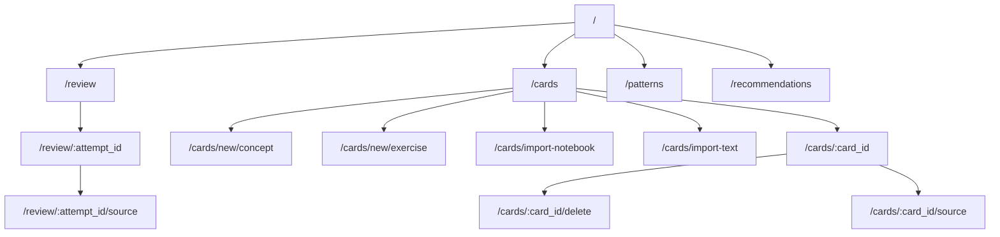

# Architecture and Roadmap

## Python Layout

```text
cli.py
study/
  app.py
  analytics.py
  card_contract.py
  config.py
  grading.py
  notebooks.py
  storage.py
  validators.py
  web.py
templates/
static/
tests/
config.toml
cards/
```

## Module Responsibilities

- `cli.py`: setup and admin entrypoint
- `study/app.py`: CLI wiring
- `study/web.py`: server-rendered routes and handlers
- `study/card_contract.py`: TOML card contract parsing and text-import validation
- `study/storage.py`: schema, queries, and mutations
- `study/notebooks.py`: source import parsing and draft generation
- `study/grading.py`: LLM-based grading and reusable model-call helpers
- `study/validators.py`: deterministic exercise validation
- `study/analytics.py`: failure clustering and recommendation generation
- prompt markdown rendering and source-link rewriting live in `study/web.py`
  because they depend on route generation plus card-bound provenance

## Main Routes

- `/`
- `/review`
- `/review/:attempt_id`
- `/cards`
- `/cards/:card_id`
- `/cards/:card_id/delete`
- `/cards/:card_id/source`
- `/cards/new/concept`
- `/cards/new/exercise`
- `/cards/import-notebook`
- `/cards/import-text`
- `/patterns`
- `/recommendations`
- `/review/:attempt_id/source`



## Constraints

- local-first
- browser-based on `localhost`
- SQLite-backed
- `.py` as the executable study format
- deterministic validation before LLM validation for exercises
- explainable scheduling and recommendation output

## Testing Plan

Focus tests on:

- scheduler behavior
- storage mutations
- review flows
- source import segmentation and regeneration
- recommendation generation
- provenance preservation

Use `unittest`, temp directories, and mocked LLM calls where possible.

## Implementation Phases

### Phase 1

- config loading
- SQLite schema
- dashboard
- concept review flow
- Leitner fallback scheduler

### Phase 2

- cards and patterns pages
- exercise scaffolding
- deterministic exercise validation
- source import
- recommendations

### Phase 3

- LLM-assisted exercise review
- stronger import enrichment
- adaptive scheduling
- richer analytics

## Open Decisions

- how strong exercise auto-test generation should become
- when to run LLM review automatically versus explicitly
- how much source prompt trimming should happen automatically
- how much analytics detail the UI should expose before it becomes noisy
