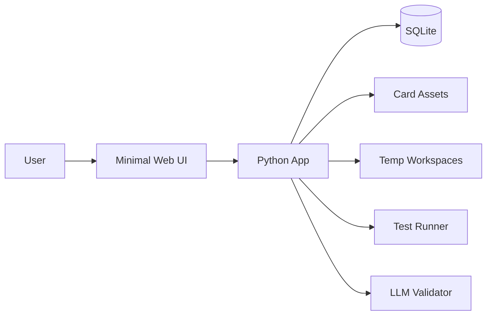

# Overview

## Goal

Build a local-first study system for retaining anything worth revisiting:

- technical concepts
- code patterns
- quiz misses
- debugging heuristics
- implementation exercises

The system should be simple enough to use daily, predictable enough to trust,
and structured enough to extend later.

## Product Direction

The early product should optimize for:

- low-friction capture
- a clear daily review queue
- deterministic scheduling
- reproducible code exercise review
- actionable failure analysis
- a minimal web UI

It should not optimize for:

- mobile sync
- rich note-taking
- notebook-native runtime artifacts
- opaque source-to-card conversion
- decorative UI chrome
- opaque AI-first behavior

## System Overview

The product is a local-first Python application with a browser UI on
`localhost`. The CLI remains useful for setup and admin tasks, but the primary
study workflow lives in the browser.

## Core Study Model

BarskyProtocol is still a spaced repetition system. The distinction is:

- spaced repetition is the learning mechanism
- a scheduler decides the next interval
- Leitner is the initial fallback scheduler
- BarskyProtocol is the product layer built for technical study

This system extends a basic flashcard SRS by:

- supporting both `concept` and `code_exercise` cards
- treating code reimplementation as a first-class review task
- analyzing failure patterns and turning them into recommendations

## Card Types

### `concept`

Use for:

- definitions
- API recall
- tradeoffs
- debugging heuristics

Structure:

- prompt
- answer
- optional topic
- optional tags
- optional source

### `code_exercise`

Use for:

- reimplementing a function, module, or class
- practicing algorithmic patterns
- rebuilding a small utility from memory

Structure:

- metadata in SQLite
- exercise assets on disk

The review task is to read the prompt, implement the Python code, run
validation, and record the result.

## UI Principles

The web UI should stay:

- sparse
- readable
- server-rendered first
- one clear action per screen
- light on button clutter, with secondary actions collapsed into dropdowns where useful
- keep global navigation compact, and avoid duplicating the dashboard's primary review action in the top bar
- keep the dashboard hero to one primary review CTA plus one compact quick-actions control
- allow the dashboard to start a normal queue or a shuffled eligible-card queue
- use consistent color cues to distinguish concept cards, coding cards, and topic labels
- let review pages move backward or forward within the current queue without forcing a return to the dashboard
- free of embedded IDE complexity in v1
