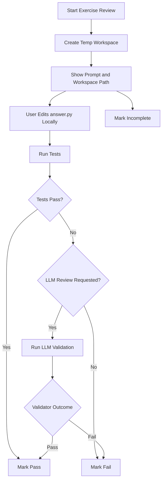

# Review Flows

## Daily Queue

When the user opens the app:

1. Load all cards where `next_review_at <= now`.
2. Build the due queue.
3. Let the user review:
   - mixed cards
   - concept only
   - exercise only

The scheduler decides what is due. The UI decides how it is presented.

Queue navigation rules:

- every review page should preserve the active queue mode: `mixed`, `concept`, or `exercise`
- the user should be able to move to the previous or next due card from the current review page
- navigation should stay inside the selected queue instead of jumping back to the dashboard
- if an adjacent card already has an active attempt, navigation should reuse it instead of creating a duplicate

## Concept Review

1. Show the prompt.
2. Render prompt markdown in the browser instead of escaping it as plain text.
3. Convert supported source references into in-app source-view links.
4. Let the user inspect the bound source context without leaving the app.
2. Let the user type an answer.
3. Grade the answer with the LLM.
4. Record `pass`, `fail`, or `incomplete`.
5. Allow previous/next navigation within the current due queue.
6. Update scheduling.

Concept review is direct and single-page.

After grading, the result page should show any card references so the user can
inspect the linked source material or metadata tied to that question.

## Code Exercise Review

1. Create a fresh temp workspace.
2. Copy canonical exercise assets into that workspace.
3. Show the rendered prompt, workspace path, editable target file, and any bound source links.
4. The user edits locally in their own editor.
5. The app runs validation from the browser.
6. The app records `pass`, `fail`, or `incomplete`.
7. The user can move to the previous or next due card without restarting review mode.
8. The scheduler updates the next review.

## Validation Rules

Validation order:

1. deterministic tests
2. optional reference-output checks
3. optional LLM review

Design rule:

- deterministic tests are the primary source of truth
- LLM review is additive, not foundational

## Prompt and Source Rendering

Prompt rendering should support markdown in the browser so imported cards do not
show raw markdown syntax.

Rules:

- render markdown to HTML for prompt display
- strip image markup from rendered prompts in v1
- allow readable link text for source references
- rewrite supported local source links into in-app viewer routes
- fall back safely when a source link cannot be resolved

The source viewer should be:

- read-only
- scoped to card-bound source files only
- usable from both card detail pages and review pages

## Workspace Lifecycle

Default policy:

- `pass` -> delete workspace
- `fail` -> retain latest workspace
- `incomplete` -> retain latest workspace

The canonical exercise directory remains the source of truth. Review attempts
do not edit it directly.

## End-to-End Loop

1. Capture study material.
2. Review what is due.
3. Validate the result.
4. Reschedule the card.
5. Analyze failures.
6. Improve future study material.

## Card Management

Cards should be manageable from the UI.

Delete behavior:

1. Delete the card row and all dependent review history through the database.
2. Delete any exercise asset directory owned by the card.
3. Delete retained temp workspaces associated with that card.
4. Preserve external source files and managed source snapshots by default.

Deletion should be explicit and user-initiated. It should not remove original
source provenance files outside the card's owned exercise assets.

## Card References

Cards may include optional textual references entered during creation.

Reference rules:

- references are stored as freeform text or markdown
- they may contain links or arbitrary metadata
- they should be visible from card detail pages and review result pages
- they should remain optional so lightweight cards stay lightweight
