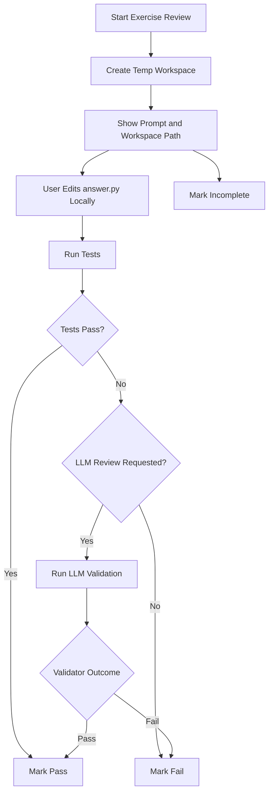

# Review Flows

## Daily Queue

When the user opens the app:

1. Load all cards where `next_review_at <= now`.
2. Build the due queue.
3. Let the user review:
   - mixed cards
   - concept only
   - exercise only

The scheduler decides what is due. The UI decides how it is presented.

## Concept Review

1. Show the prompt.
2. Let the user type an answer.
3. Grade the answer with the LLM.
4. Record `pass`, `fail`, or `incomplete`.
5. Update scheduling.

Concept review is direct and single-page.

## Code Exercise Review

1. Create a fresh temp workspace.
2. Copy canonical exercise assets into that workspace.
3. Show the prompt, workspace path, and editable target file.
4. The user edits locally in their own editor.
5. The app runs validation from the browser.
6. The app records `pass`, `fail`, or `incomplete`.
7. The scheduler updates the next review.

## Validation Rules

Validation order:

1. deterministic tests
2. optional reference-output checks
3. optional LLM review

Design rule:

- deterministic tests are the primary source of truth
- LLM review is additive, not foundational

## Workspace Lifecycle

Default policy:

- `pass` -> delete workspace
- `fail` -> retain latest workspace
- `incomplete` -> retain latest workspace

The canonical exercise directory remains the source of truth. Review attempts
do not edit it directly.

## End-to-End Loop

1. Capture study material.
2. Review what is due.
3. Validate the result.
4. Reschedule the card.
5. Analyze failures.
6. Improve future study material.

## Card Management

Cards should be manageable from the UI.

Delete behavior:

1. Delete the card row and all dependent review history through the database.
2. Delete any exercise asset directory owned by the card.
3. Delete retained temp workspaces associated with that card.
4. Preserve external source files and managed source snapshots by default.

Deletion should be explicit and user-initiated. It should not remove original
source provenance files outside the card's owned exercise assets.
